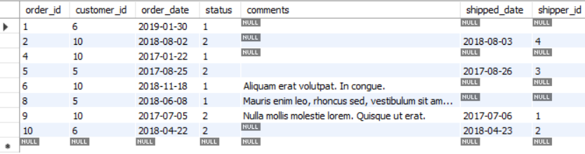
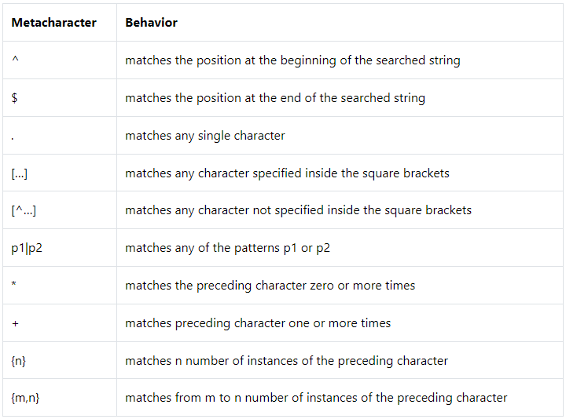

<div id='top'>
   
<!-- Logo-->
<p align="center">

</p>

   
# My "MySQL" Notes  Day-3

I started learning MySQL as a part of advanced web developer learning. Heres all my notes and cheats for MySQL.

```sql
SELECT *
FROM sql_inventory.products;
```
Basic MySQL statement.

# Table of Contents

- <a href='#intro'>Introduction
- <a href='#syntax'>Syntax

<!-- Introduction -->

<div id="intro">

# What is MySQL ?
   
MySQL is an open source SQL relational database management system that’s developed and supported by Oracle. Usually MySQL uses tables to store datas connects it with “keys”. 
   
</div>
<!-- Syntaxes -->

<div id='syntax'>
   
# Syntax

- <a href='#select'>SELECT
   - <a href='#as'>AS
   - <a href='#distinct'>DISTINCT
- From
- <a href='#where'>WHERE
   - <a href="#operators">Logical Operators
- <a href='#orderby'>ORDER BY
   - <a href='#desc'>DESC
- <a href='#limit'>LIMIT
- <a href='#join'>JOIN

</div>
 
<!-- Select -->
<div id='select'>

## SELECT

SELECT statements select data from one or more tables.

```sql
-- use asterix (*) to get all the column from the table
SELECT *
FROM sql_inventory.products;
```

```sql
SELECT 
name,
unit_price
FROM sql_inventory.products;
```
Output:
   

</div>

   
<!-- AS -->
<div id='as'>
   
### AS
   
AS command can rename a column and name a new collumn.
   
```sql
 SELECT 
 name,
 unit_price,
 unit_price * 1.1 AS new_price
 FROM sql_inventory.products;
```
Output:
   
 
   
</div>

<!-- Distinct -->

<div id='distinct'>

### DISTINCT

DISTINCT clause remove the duplocate data.

```sql
SELECT state
FROM sql_store.customers;
```
Output:

 

```sql
SELECT DISTINCT state
FROM sql_store.customers;
```
Output:

 
   
</div>

<!-- where -->

<div id='where'>

   ## WHERE

The WHERE clause is used to filter records.

```sql
SELECT *
FROM sql_store.orders
WHERE customer_id = 10
```
Output:

 

<div id="operators">

## MySQL Logical Operators & Functions:
- <a href='#and'>AND
- <a href='#or'>OR
- <a href='#not'>NOT
- <a href='#in'>IN
- <a href='#notin'>NOT IN
- <a href='#between'>BETWEEN
- <a href='#like'>LIKE
- <a href='#regexp'>REGEXP
- <a href='#isnull'>IS NULL
- <a href='#isnotnull'>IS NOT NULL

</div>

<div id='and'>
   
### AND operator
   
AND operator compares two expressions and returns true if both of the expressions are true.

```sql
SELECT *
FROM sql_store.orders
WHERE customer_id = 10 AND status > 1
```
Output:

 

</div>
   
<div id='or'>

### OR operator
   
OR operator compares two expressions and returns TRUE if either of the expressions is TRUE.

```sql
SELECT *
FROM sql_store.orders
WHERE customer_id = 10 OR status > 1
```
Output:

 

</div>
   
<div id='not'>
   
### NOT operator
   
NOT operator reverses or negates the input.
   
```sql
-- NOT operator doest the oposite of the condition
SELECT *
FROM sql_store.orders
WHERE NOT customer_id = 10 AND status > 1
```
Output:


   
</div>
   
<div id='in'>
  
### IN function
   
IN() function finds a match in the given arguments.
   
```sql
SELECT *
FROM sql_store.orders
-- WHERE customer_id = 10 OR  customer_id = 5 OR customer_id = 6
WHERE customer_id IN (10 , 5 , 6)
```
Output:


   
</div>
   
<div id='notin'>

### NOT IN function

NOT IN() makes sure that the expression proceeded does not have any of the values present in the arguments.
   
```sql
SELECT *
FROM sql_store.orders
-- WHERE customer_id = 10 OR  customer_id = 5 OR customer_id = 6
WHERE customer_id NOT IN (10 , 5 , 6)
```
Output:


</div>
   
<div id='between'>
   
### BETWEEN operator
   
BETWEEN... AND operator checks whether a value is within a range.
   
```sql
SELECT DISTINCT *
FROM sql_store.customers
WHERE birth_date between '1990-01-01' AND '2000-01-01'
```
Output:

 
   
</div>
   
<div id='like'>
   
### LIKE operator
   
BETWEEN AND operator checks whether a value is within a range.
   
```sql
SELECT DISTINCT *
FROM sql_store.customers
--  % means there can be any number of charecter after 'B'
WHERE first_name LIKE 'B%'
```
Output:

 
   
```sql
SELECT DISTINCT *
FROM sql_store.customers
--  5 _ means there will be exactly 5 charecter after 'B'
WHERE first_name LIKE 'B_____'
```
Output:

 
   
</div>
   
<div id='regexp'>
   
### REGEXP operator
   
REGEXP performs a pattern match of a string expression against a pattern. The pattern is supplied as an argument.
   
 <a href='https://github.com/Xoaib007/MySQL-Notes/blob/main/REGEXP.md'>know REGEXP in detals

 #### REGEXP METACHARECTERS:

 
   
</div>
   
<div id='isnull'>
   
### IS NULL operator
   
IS NULL Condition is used to test for a NULL value.
   
```sql
SELECT * 
FROM sql_store.orders
WHERE shipped_date IS NULL
```
Output:

 
   
</div>
   
<div id='isnotnull'>
   
### IS NOT NULL operator
   
IS NOT NULL condition is used to test for a value that is not null.
   
```sql
SELECT * 
FROM sql_store.orders
WHERE shipped_date IS NOT NULL
```
Output:

 
   
</div>

<!-- Order by -->
   
<div id='orderby'>
   
## ORDER BY
   
ORDER BY clause is used to sort the records in your result set. By default ORDER BY sets data in ascending order.
   
```sql
SELECT *
FROM sql_store.products
ORDER BY unit_price
```
Output:


   
</div>
   
<div id='desc'>
   
### DESC
   
DESC keyword sorts the records in descending order.
   
```sql
SELECT *
FROM sql_store.products
ORDER BY unit_price DESC
```
Output:


   
</div>
   
<div id='limit'>
   
## LIMIT
   
LIMIT clause is used to specify the number of records to return.
   
```sql
SELECT DISTINCT *
FROM sql_store.customers
ORDER BY points DESC
LIMIT 0, 3
```
Output:


   
</div>
   
<div id='join'>
   
## JOIN
   
JOIN clause is used to combine rows from two or more tables, based on a related column between them.
   
```sql
SELECT 
order_id,
first_name, 
last_name
FROM sql_store.orders
JOIN sql_store.customers
ON orders.customer_id = customers.customer_id
```
Output:


   
</div>

   
<p align='center'>
   </br>  </br>  </br>  </br>
   <a href='#top'>Go to top
</p>
</div>
