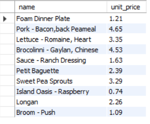
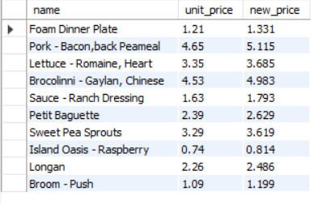
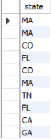
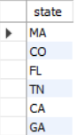
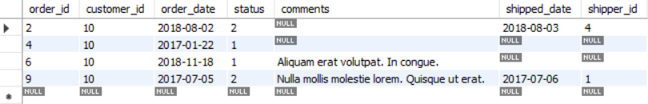
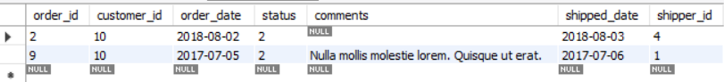
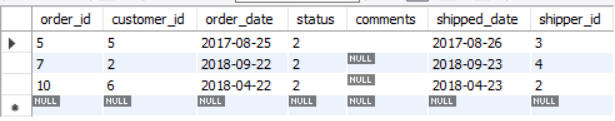

<!-- Logo-->
<p align="center">

</p>

   
# My "MySQL" Notes

I started learning MySQL as a part of advanced web developer learning. Heres all my notes and cheats for MySQL.


<!-- Syntaxes -->

# Syntaxes

- <a href='#select'>SELECT</a>
   - <a href='#as'>AS</a>
   - <a href='#distinct'>DISTINCT</a>
- From
- WHERE
 
 
<!-- Select -->
<div id='select'>

## SELECT

SELECT statements select data from one or more tables.

```javascript
<!-- use asterix (*) to get all the data from the table -->
SELECT *
FROM sql_inventory.products;
```

```javascript
SELECT 
name,
unit_price
FROM sql_inventory.products;
```
#### Output:
   

</div>

   
<!-- AS -->
<div id='as'>
   
### AS
   
AS command can rename a column and name a new collumn.
   
```javascript
 SELECT 
 name,
 unit_price,
 unit_price * 1.1 AS new_price
 FROM sql_inventory.products;
```
#### Output:
   
 
   
</div>

<!-- Distinct -->

<div id='distinct'>

### AS

DISTINCT clause remove the duplocate data.

```javascript
SELECT state
FROM sql_store.customers;
```
#### Output:

 

```javascript
SELECT DISTINCT state
FROM sql_store.customers;
```
#### Output:

 
   
</div>

<!-- where -->

<div id='where'>

   ## WHERE

The WHERE clause is used to filter records.

```javascript
SELECT *
FROM sql_store.orders
WHERE customer_id = 10
```
#### Output:

 

Both Comparison and Logical operators can be use in WHERE clause.

##### Comparison Opertors: < , <= , > , >= , = , != , <>

##### Logical Operators: AND , OR , NOT

```javascript
SELECT *
FROM sql_store.orders
WHERE customer_id = 10 AND status > 1
```
#### Output:

 
   
```javascript
<!-- With NOT -->
SELECT *
FROM sql_store.orders
WHERE NOT customer_id = 10 AND status > 1
```
#### Output:

 
   
   
</div>
